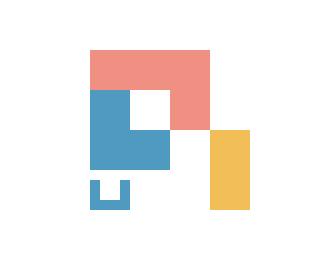

<p align="center">
  <a href="https://pi.dev">
    
  </a>
</p>
<!-- <p align="center">
  <a href="https://discord.com/invite/3cU7Bz4UPx"></a>
  <a href="https://www.npmjs.com/package/@earendil-works/pi-coding-agent"></a>
</p> -->

# Unreal Pi

Unreal Pi is a fork of Pi with asynchronous shell operations inspired by [Unreal Harness](https://github.com/unreallabsai/unreal-agent) by Unreal Labs. The async extension adds `run_async`, `operation_status`, `operation_output`, and `operation_cancel`.

Use `run_async` by default for slow shell commands, including tests, builds, installs, and network requests. It returns an operation ID immediately, so Pi can keep inspecting or editing while the command runs. If the next step depends on the result, Pi ends the turn and resumes when the operation completes, fails, or is cancelled and its compact notification arrives automatically. Reserve synchronous `bash` for quick commands; there is no need to poll for completion.

Async execution currently applies to shell commands. Tools such as `read` and `edit` continue to run as ordinary awaited calls. See the [async extension](packages/async-pi-extension/README.md) for setup and details.

## Getting started

Build this fork with asynchronous shell operations enabled:

```bash
git clone https://github.com/shxntanu/unreal-pi.git
cd unreal-pi
npm install --ignore-scripts
npm run hydrate:model-data
make pi
```

Then start Pi in the project directory where you want it to work:

```bash
cd /path/to/project
pi
```

The `pi` command must point to this checkout's `packages/coding-agent/dist/pi` binary. `make pi` builds that binary and registers the async extension in your global Pi settings. If `pi` is not on your `PATH`, run the binary by its full path or add a symlink to a directory on your `PATH`.

For a built-in AI provider, run `/login` inside Pi to connect a subscription or API key. Then give Pi a task.

## Packages

This monorepo contains the Pi CLI and its supporting libraries.

| Package                                                      | Description                                                                                 |
| ------------------------------------------------------------ | ------------------------------------------------------------------------------------------- |
| **[@earendil-works/chord](packages/chord)**                  | Standalone application-composition runtime for services, replicated state, RPC, and plugins |
| **[@earendil-works/pi-telemetry](packages/telemetry)**       | Vendor-neutral telemetry contracts, reference adapter, conformance tests, and typed schemas |
| **[@earendil-works/pi-ai](packages/ai)**                     | Unified multi-provider LLM API (OpenAI, Anthropic, Google, etc.)                            |
| **[@earendil-works/pi-durable](packages/durable)**           | Durable conversation, task, and document runtime                                            |
| **[@earendil-works/pi-agent-core](packages/agent)**          | Agent runtime with tool calling and state management                                        |
| **[@earendil-works/pi-coding-agent](packages/coding-agent)** | Interactive coding agent CLI                                                                |
| **[@earendil-works/pi-tui](packages/tui)**                   | Terminal UI library with differential rendering                                             |

For Slack/chat automation and workflows see [earendil-works/pi-chat](https://github.com/earendil-works/pi-chat).

## Permissions & Containerization

Pi does not include a built-in permission system for restricting filesystem, process, network, or credential access. By default, it runs with the permissions of the user and process that launched it.

If you need stronger boundaries, containerize or sandbox Pi. See [packages/coding-agent/docs/containerization.md](packages/coding-agent/docs/containerization.md) for three patterns:

- **Gondolin extension**: keep `pi` and provider auth on the host while routing built-in tools and `!` commands into a local Linux micro-VM.
- **Plain Docker**: run the whole `pi` process in a local container for simple isolation.
- **OpenShell**: run the whole `pi` process in a policy-controlled sandbox.

## Contributing

See [CONTRIBUTING.md](CONTRIBUTING.md) for contribution guidelines and [AGENTS.md](AGENTS.md) for project-specific rules (for both humans and agents). Longer term plans for Pi can also be found in [RFCs](https://rfc.earendil.com/keyword/pi/).

## Development

```bash
npm install --ignore-scripts  # Install all dependencies without running lifecycle scripts
npm run build         # Refresh model data, then build all packages
npm run build:offline # Rebuild using existing model data without network access
npm run check         # Lint, format, and type check
./test.sh            # Run tests (skips LLM-dependent tests without API keys)
./pi-test.sh         # Run pi from sources (can be run from any directory)
```

## Building standalone binaries from release source

GitHub releases include a versioned source archive covered by the release's `SHA256SUMS` file. Extract it and run the same build script used for the official standalone binaries:

```bash
VERSION="<release-version>"
tar -xzf "pi-${VERSION}-source.tar.gz"
cd "pi-${VERSION}"
./scripts/build-binaries.sh --offline-model-data --platform linux-x64 --out "$PWD/out"
```

The archive includes release model data and native prebuilds. `--offline-model-data` uses that model data without refreshing provider catalogs. The script installs dependencies and builds the executable with its runtime assets; pass `--skip-install` if dependencies are already provided.

## License

MIT
